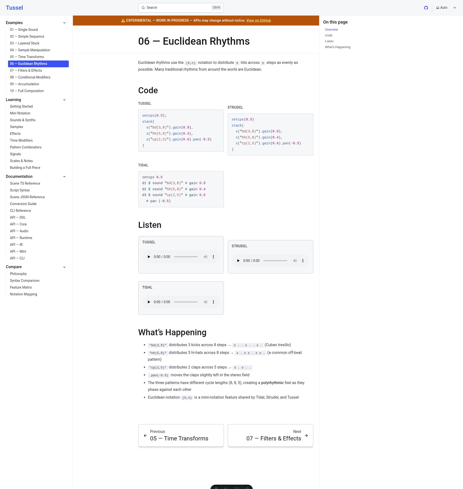
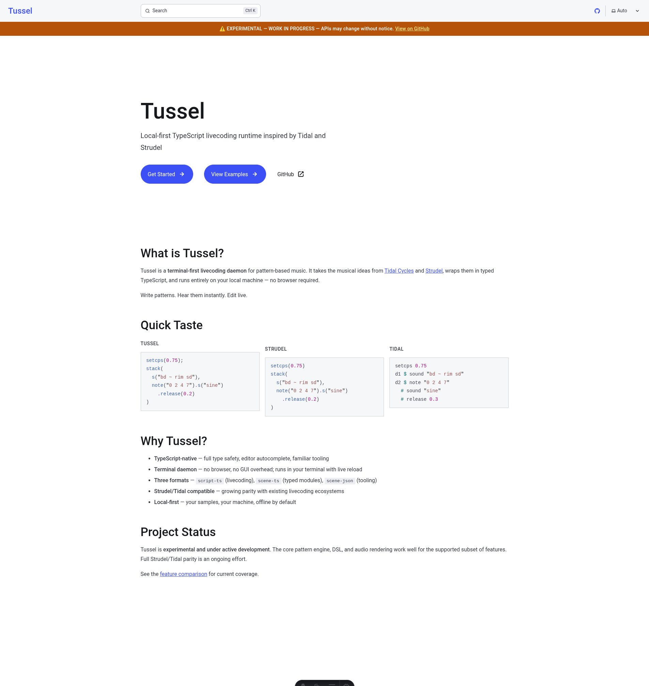

# Tussel


## At a glance

A local-first TypeScript runtime for livecoding pattern-based music in the terminal.





> **This project is experimental and under active development. APIs will change without notice. Do not use in production.**

Tussel is a local-first TypeScript livecoding runtime for pattern-based music, inspired by [TidalCycles](https://tidalcycles.org/) and [Strudel](https://strudel.cc/). It runs as a terminal daemon — no browser required.

## Status

**Work in progress.** This is an early-stage experiment. Expect:

- Breaking changes on every commit
- Missing features and incomplete implementations
- Bugs, rough edges, and undocumented behavior
- No stability guarantees whatsoever

If you're looking for a production-ready livecoding environment, use [Strudel](https://strudel.cc/) or [TidalCycles](https://tidalcycles.org/) instead.

## What it does

Tussel takes pattern expressions like:

```ts
s("bd sd [hh hh] cp").fast(2).gain(0.8)
```

and renders them to audio in real time from your terminal. It supports:

- **Mini notation** — Tidal-style pattern strings (`"bd [sd sd] hh"`)
- **Pattern transforms** — `fast`, `slow`, `rev`, `jux`, `every`, `sometimes`, and 80+ more
- **Signal modulation** — `sine`, `saw`, `rand`, `perlin` as continuous control signals
- **Effects** — delay, reverb, filters, distortion, phaser, FM synthesis
- **MIDI/OSC output** — send patterns to external synths and software
- **Hot reload** — edit your scene file, hear changes immediately
- **Offline rendering** — export patterns to WAV files

## Architecture

pnpm monorepo with 9 packages:

| Package | Purpose |
|---------|---------|
| `@tussel/core` | Pattern query engine and transforms |
| `@tussel/dsl` | PatternBuilder / SignalBuilder API |
| `@tussel/audio` | Web Audio rendering, samples, effects |
| `@tussel/ir` | Expression node types, structured logger |
| `@tussel/mini` | Mini notation parser |
| `@tussel/runtime` | Scene compilation, daemon, Tidal/Strudel adapters |
| `@tussel/cli` | CLI entry point |
| `@tussel/parity` | Audio comparison tests against Strudel reference |
| `@tussel/testkit` | Shared test utilities |

## Getting started

Requires Node.js >= 20 and pnpm.

```bash
pnpm install
pnpm check        # lint + typecheck + test
```

Run a scene:

```bash
./bin/tussel run examples/basic.scene.ts
```

## Acknowledgments

Tussel is a clean-room reimplementation. It does not share code with Tidal or Strudel, but it would not exist without the ideas pioneered by [Alex McLean](https://slab.org/) and the TidalCycles/Strudel communities. The pattern language design, mini notation syntax, and many method names originate from their work.

- [TidalCycles](https://tidalcycles.org/) — GPL-3.0
- [Strudel](https://strudel.cc/) — AGPL-3.0

## License

[MIT](LICENSE)
